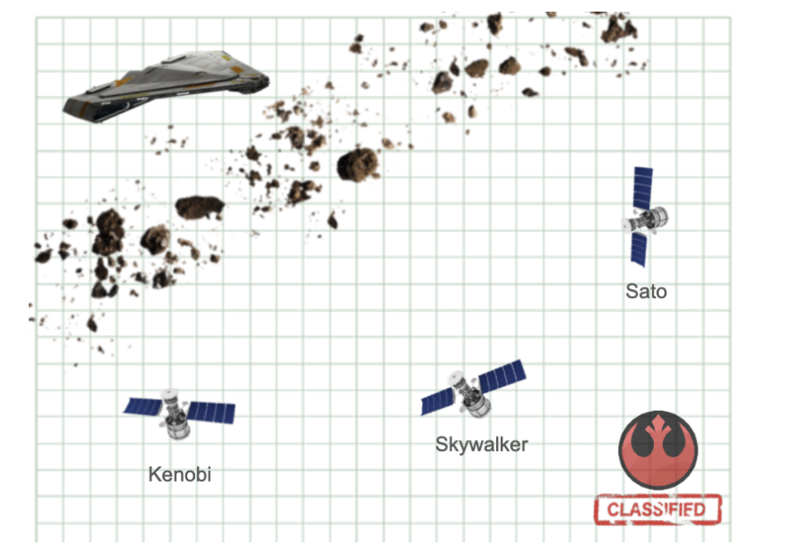

# Challenge 
## Operation Quasar Fire
### for MercadoLibre

Han Solo was recently appointed General of the Alliance
Rebel and seeks to strike a great blow against the Galactic Empire to
rekindle the flame of resistance.
The rebel intelligence service has detected a call for help from
an Imperial cargo ship adrift in an asteroid field. The
The ship's manifest is ultra classified, but it is rumored that
carries rations and weapons for an entire legion.




## Demo

[Live Demo](http://104.154.79.57/)


## How to start? 🚀

### Requirements 📋

The project was developed with the following technologies:

- Java 1.8.0_231
- Maven 3.6.0

### Installation 🔧

Execute the following instructions:

#### Clone and Installation
```
# clone dto project
git clone --branch develop https://github.com/jeffer-mendoza/challenge.dto.git
cd challenge.dto
mvn clean install

# clone project 
git clone --branch develop https://github.com/jeffer-mendoza/challenge.git
cd challenge
mvn clean install

```

## Test 

Unit Test
````bash
# execute unit test
mvn test 
mvn jacoco:report

# open file in browser to see coverage of tests
target/site/jacoco/index.html
````

Postman

[Test cases in postman: support v2.1 Collections](doc/test-cases/challenge.postman_collection_v2.1.json)

create the environment in postman for the execution of the tests:

| Env   | variable | value                 |
|-------|----------|-----------------------|
| local | host     | http://127.0.0.1:80   |
| pro   | host     | http://104.154.79.57/ |


## Deployment 📦


```bash 
# clone dto project
git clone https://github.com/jeffer-mendoza/challenge.dto.git
cd challenge.dto
mvn clean install 
cd ..

# clone project 
git clone https://github.com/jeffer-mendoza/challenge.git
cd challenge

# execute prepare-enviroment script
## Creates an App Engine application.
## Exports environment variable GCLOUD_PROJECT.
## Runs mvn clean install
## Copy jar to Docker workspace
## Create Container Engine cluster
## Building Containers
## Deploy to Container Engine
## Prints out the Project ID.
. prepare_environment.sh

# check
click Navigation menu > Kubernetes Engine > Workloads 
```

## Built with 🛠️

Technologies and tools used in the development of the project:

* [Sprint Boot](https://spring.io/projects/spring-boot) - The Web Framework
* [Maven](https://maven.apache.org/) - Dependencies Management
* [Google Cloud Platform](https://cloud.google.com/) - Cloud Provider
* [Google Kubernetes Engine
](https://cloud.google.com/kubernetes-engine/) - Deployment Tool
* [Intellij Idea Community Edition](https://www.jetbrains.com/es-es/idea/download) - IDE


## Authors ✒️


* **Jefferson Mendoza** - *Fullstack Developer* - [jeffer-mendoza](https://github.com/jeffer-mendoza/)

see **contributors**

## License 📄

This project is under license [LICENSE](LICENSE) 


## Contributors

[](https://github.com/jeffer-mendoza/)

---


