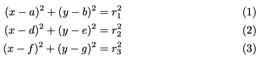
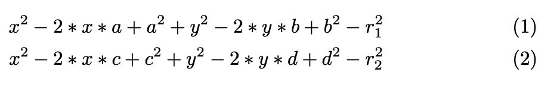
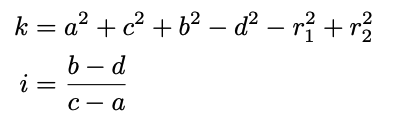
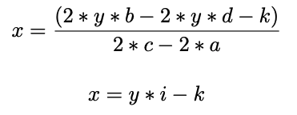
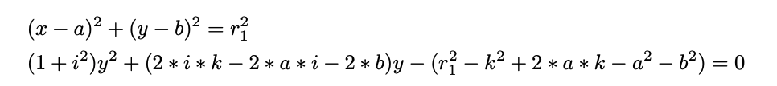
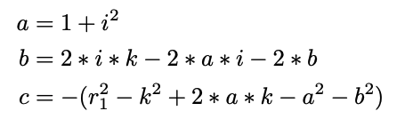
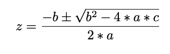

# Mathematical Model Documentation
## Problem: Trilateralation

Given three known points in the plane, and knowing the distances to a point (x, y), find its position

### 1. Step 

Create a system of equations with the equation of distance between two points

given the known points:
- P1 = (a, b)
- P2 = (c, d)
- P3 = (d, e)

system of equations

### 2. Step 

formulas 1 and 2 are equated to reduce to a level 1 equation

### 3. Step 
By reducing the level 2 terms, the equation is developed and substitutions are made to facilitate the development

### 4. Step 
applying the substitutions the formula is found to obtain x

### 5. Step 
in formula 1 x is replaced and developed, expressing the formula in a quadratic equation

### 6. Step 
From the second degree equation formula, the terms of a, b and c are identified

### 7. Step 
finally these are replaced and the roots of y can be found

once the roots of y have been found, replace each one in the equation found in step 4.

finally, the ordered pair is replaced in the system of equations and it is verified that it is satisfied.

## Conclusion

The steps described above allow us to equalize the equations of the circumference that can be formed with the vectors and the distances that are the inputs to the problem.

This equalization provides us with the different interceptions in the plane and the location of the unknown point

## Bibliography

* Trilateración - [Wikipedia](https://es.wikipedia.org/wiki/Trilateraci%C3%B3n#:~:text=La%20trilateraci%C3%B3n%20es%20un%20m%C3%A9todo,forma%20an%C3%A1loga%20a%20la%20triangulaci%C3%B3n.)